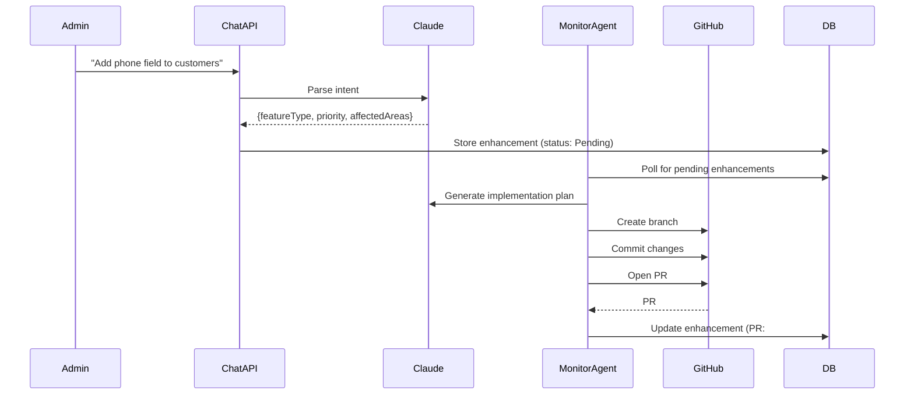

<div align="center">
  
  <h1>Modern Accounting</h1>
  <p><strong>AI-powered accounting platform that evolves itself through chat</strong></p>
  <p>Full double-entry accounting with QuickBooks migration, bank reconciliation, and autonomous feature development</p>

  <p>
    
    
    
    
    
  </p>
  <p>
    
    
    
  </p>
</div>

---

## Overview

Modern Accounting is a **self-evolving** accounting system. Beyond standard bookkeeping features, it includes an **AI agent** that can implement new features autonomously—admins describe what they want in plain English, and the system writes code, creates PRs, and deploys changes.

```
Admin: "Add a phone number field to the customer form"
   ↓
Claude AI plans the implementation
   ↓
Monitor Agent creates branch, writes code, opens PR
   ↓
Copilot reviews → Merge → Auto-deploy to staging
```

<details>
<summary><strong>Why Modern Accounting?</strong></summary>

- **No vendor lock-in**: Own your data, self-host anywhere
- **QuickBooks migration**: One-click import of all QBO data with intelligent mapping
- **AI-first architecture**: Chat interface for both users and admins
- **Production-ready**: Docker deployment, Azure integration, enterprise auth
- **Extensible**: Database-driven configuration allows changes without code deploys

</details>

---

## Features

### Core Accounting
| Feature | Description |
|---------|-------------|
| **Invoicing & Estimates** | Create, edit, email invoices with PDF generation |
| **Bills & Payments** | Vendor payables with payment tracking |
| **Bank Reconciliation** | Import transactions, AI-assisted categorization |
| **Journal Entries** | Direct GL entries for complex transactions |
| **Chart of Accounts** | Standard double-entry account structure |
| **Reporting** | P&L, Balance Sheet, Trial Balance, AR Aging |

### AI-Driven Features
| Feature | Description |
|---------|-------------|
| **Chat Interface** | Natural language queries about your books |
| **Smart Categorization** | AI suggests categories for bank transactions |
| **Feature Requests** | Describe changes in English → AI implements them |
| **Self-Healing Migrations** | Database-driven mappings auto-correct issues |

### Integrations
| Integration | Capabilities |
|-------------|--------------|
| **QuickBooks Online** | OAuth connection, full data migration |
| **CSV Import** | Bank statements, Capital One, generic CSV |
| **Email (SMTP)** | Invoice delivery with HTML templates |
| **GitHub** | Automated PR creation and code review |

---

## Quick Start

### Prerequisites
- [Docker Desktop](https://www.docker.com/products/docker-desktop/)
- [Node.js 20+](https://nodejs.org/)
- [Git](https://git-scm.com/)

### One-Command Setup

**Windows (PowerShell):**
```powershell
git clone https://github.com/ehalsey/modern-accounting.git
cd modern-accounting
.\dev.ps1
```

**Linux/Mac:**
```bash
git clone https://github.com/ehalsey/modern-accounting.git
cd modern-accounting
./start-dev.sh
```

### What Gets Started
| Service | URL | Purpose |
|---------|-----|---------|
| Client | http://localhost:5173 | React frontend |
| Chat API | http://localhost:7071 | Express backend |
| DAB API | http://localhost:5000 | GraphQL + REST |
| SQL Server | localhost:14330 | Database |

<details>
<summary><strong>Manual Setup</strong></summary>

```bash
# 1. Start Docker services
docker compose up -d

# 2. Run database migrations
cd scripts && node deploy-db.js

# 3. Start API (terminal 1)
cd chat-api && npm install && npm start

# 4. Start Client (terminal 2)
cd client && npm install && npm run dev
```

</details>

---

## Architecture

```
┌─────────────────────────────────────────────────────────────────┐
│                        React Client                              │
│  (Vite + TypeScript + Tailwind + MUI DataGrid + React Query)    │
└─────────────────────────────┬───────────────────────────────────┘
                              │
        ┌─────────────────────┼─────────────────────┐
        ▼                     ▼                     ▼
┌───────────────┐    ┌───────────────┐    ┌───────────────┐
│   Chat API    │    │   DAB API     │    │  Email API    │
│  (Express.js) │    │  (GraphQL+    │    │  (Puppeteer   │
│               │    │   REST)       │    │   + SMTP)     │
└───────┬───────┘    └───────┬───────┘    └───────────────┘
        │                    │
        └────────┬───────────┘
                 ▼
        ┌───────────────┐         ┌───────────────┐
        │  SQL Server   │◄────────│Monitor Agent  │
        │  (Azure SQL   │         │ (Claude AI +  │
        │   Edge)       │         │  GitHub API)  │
        └───────────────┘         └───────────────┘
```

### Directory Structure

```
modern-accounting/
├── client/                 # React frontend
│   ├── src/pages/         # 50+ page components
│   ├── src/hooks/         # React Query hooks
│   └── tests/             # Playwright E2E tests
├── chat-api/              # Main Express backend
│   ├── migration/         # QBO migration logic
│   └── tests/             # Unit tests
├── monitor-agent/         # AI feature processor
├── email-api/             # Invoice emails
├── csv-import-api/        # Bank statement import
├── qbo-mcp-http-server/   # QuickBooks MCP
├── database/              # SQL schema & migrations
│   ├── migrations/        # 22+ migration scripts
│   └── dbo/Tables/        # 23+ table definitions
├── scripts/               # DevOps utilities
└── docs/                  # Documentation
```

---

## Tech Stack

<table>
<tr>
<td width="50%" valign="top">

### Frontend
- **React 18** with TypeScript
- **Vite** for blazing-fast builds
- **Tailwind CSS** + **MUI v7**
- **TanStack Query** for data fetching
- **React Router v7**
- **Recharts** for dashboards
- **Playwright** for E2E testing

</td>
<td width="50%" valign="top">

### Backend
- **Express.js** (Node 20)
- **Data API Builder** (GraphQL + REST)
- **SQL Server** (Azure SQL Edge)
- **Anthropic Claude** for AI features
- **Octokit** for GitHub integration
- **Puppeteer** for PDF generation

</td>
</tr>
</table>

---

## AI Feature System

The crown jewel of Modern Accounting is its **self-evolving architecture**. Administrators can request new features through a chat interface, and the system autonomously implements them.

### How It Works



### Enable the Monitor Agent

```bash
# Set required environment variables
export ANTHROPIC_API_KEY=your-key
export GITHUB_TOKEN=your-token

# Start the agent
cd monitor-agent && npm run dev
```

### Submit a Feature Request

```bash
curl -X POST http://localhost:7071/api/enhancements \
  -H "Content-Type: application/json" \
  -d '{"description": "Add a notes field to the vendor form"}'
```

<details>
<summary><strong>Database Tables for Self-Healing</strong></summary>

The migration framework uses database-driven configuration:

| Table | Purpose |
|-------|---------|
| `MigrationFieldMaps` | Field name mappings (QBO → ACTO) |
| `MigrationTypeMaps` | Value mappings (e.g., "Bank" → "Asset") |
| `MigrationEntityMaps` | ID mappings for relationships |
| `MigrationConfigs` | Runtime configuration |

Fix issues without code changes:
```sql
UPDATE MigrationFieldMaps
SET TargetField = 'CompanyName'
WHERE SourceField = 'DisplayName' AND EntityType = 'Customer';
```

</details>

---

## QuickBooks Integration

Migrate your entire QuickBooks Online account with one click.

### Supported Data
- Customers & Vendors
- Chart of Accounts
- Products & Services
- Invoices & Bills
- Payments & Journal Entries

### Setup

1. Create a QuickBooks app at [developer.intuit.com](https://developer.intuit.com)
2. Configure OAuth credentials in `.env`
3. Connect via the Settings page in the app

```bash
# Required environment variables
QBO_CLIENT_ID=your-client-id
QBO_CLIENT_SECRET=your-client-secret
QBO_REDIRECT_URI=http://localhost:7071/api/qbo/callback
```

---

## Scripts & Commands

### Development

| Command | Description |
|---------|-------------|
| `.\dev.ps1` | Start everything (Windows) |
| `./start-dev.sh` | Start everything (Linux/Mac) |
| `.\dev.ps1 -Status` | Check service health |
| `.\dev.ps1 -Stop` | Stop all services |

### Testing

```bash
# E2E tests (Playwright)
npm test

# Interactive test UI
npm run test:ui

# Unit tests
cd chat-api && npm test
cd monitor-agent && npm test
```

### Database

```bash
# Run migrations
cd scripts && node deploy-db.js

# Connect via sqlcmd
sqlcmd -S localhost,14330 -U sa -P $SQL_SA_PASSWORD -d AccountingDB
```

---

## Environment Variables

Create a `.env` file in the root directory:

```bash
# Database (required)
SQL_SA_PASSWORD=YourStrongPassword123
SQL_SERVER=localhost
SQL_PORT=14330
SQL_DATABASE=AccountingDB

# AI Features (optional)
ANTHROPIC_API_KEY=sk-ant-...
GITHUB_TOKEN=ghp_...
GITHUB_OWNER=your-username
GITHUB_REPO=modern-accounting

# QuickBooks (optional)
QBO_CLIENT_ID=...
QBO_CLIENT_SECRET=...

# Email (optional)
SMTP_HOST=smtp.gmail.com
SMTP_PORT=587
SMTP_USER=your-email@gmail.com
SMTP_PASS=app-password
```

See [.env.example](.env.example) for all options.

---

## Documentation

| Document | Description |
|----------|-------------|
| [AI Feature System](docs/ai-feature-system.md) | Architecture deep-dive |
| [AI Setup Guide](docs/ai-feature-setup.md) | Monitor agent configuration |
| [API Reference](docs/api-reference.md) | Endpoint documentation |
| [AI Workflow Diagram](docs/ai-workflow-diagram.md) | Visual architecture |
| [Development Guide](DEVELOPMENT.md) | Local setup details |
| [Security](SECURITY.md) | Secrets management |

---

## Contributing

Contributions are welcome! Please read our contributing guidelines before submitting PRs.

1. Fork the repository
2. Create a feature branch (`git checkout -b feature/amazing-feature`)
3. Commit your changes (`git commit -m 'Add amazing feature'`)
4. Push to the branch (`git push origin feature/amazing-feature`)
5. Open a Pull Request

---

## License

Distributed under the MIT License. See [LICENSE](LICENSE) for more information.

---

## Acknowledgments

- [Anthropic Claude](https://anthropic.com) - AI backbone for feature generation
- [Microsoft Data API Builder](https://github.com/Azure/data-api-builder) - GraphQL/REST layer
- [QuickBooks API](https://developer.intuit.com) - Accounting data migration
- [Tailwind CSS](https://tailwindcss.com) - Utility-first styling
- [MUI](https://mui.com) - React component library

---

<div align="center">
  <p>Built with AI assistance from Claude</p>
  <p>
    <a href="https://github.com/ehalsey/modern-accounting/issues">Report Bug</a>
    ·
    <a href="https://github.com/ehalsey/modern-accounting/issues">Request Feature</a>
  </p>
</div>
