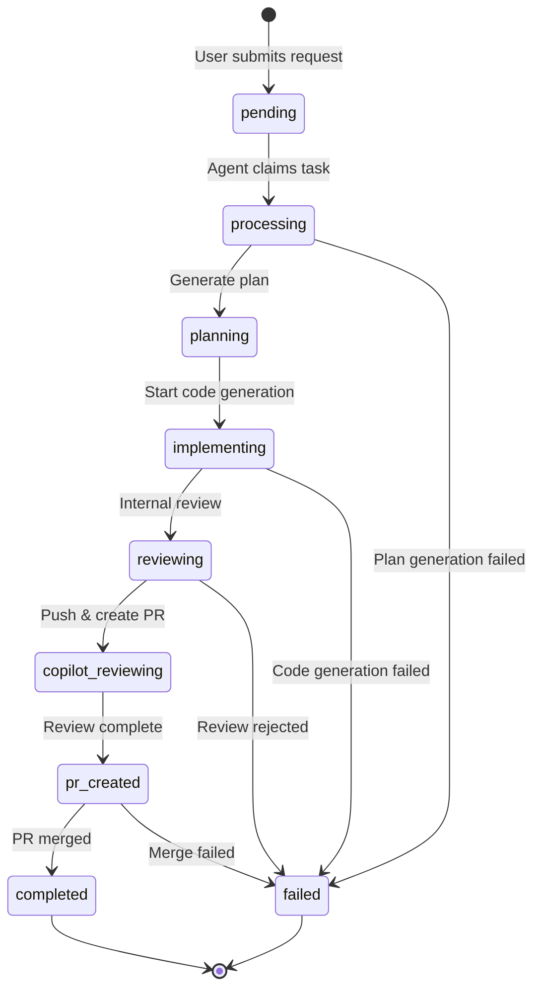
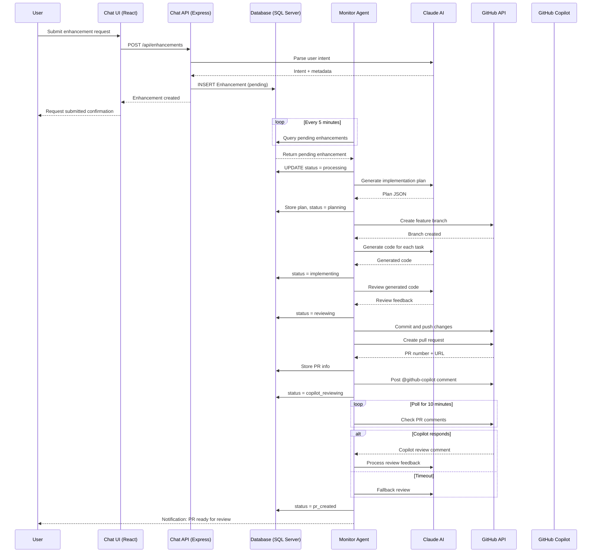
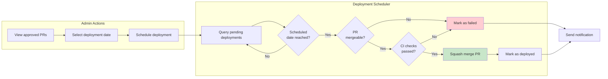
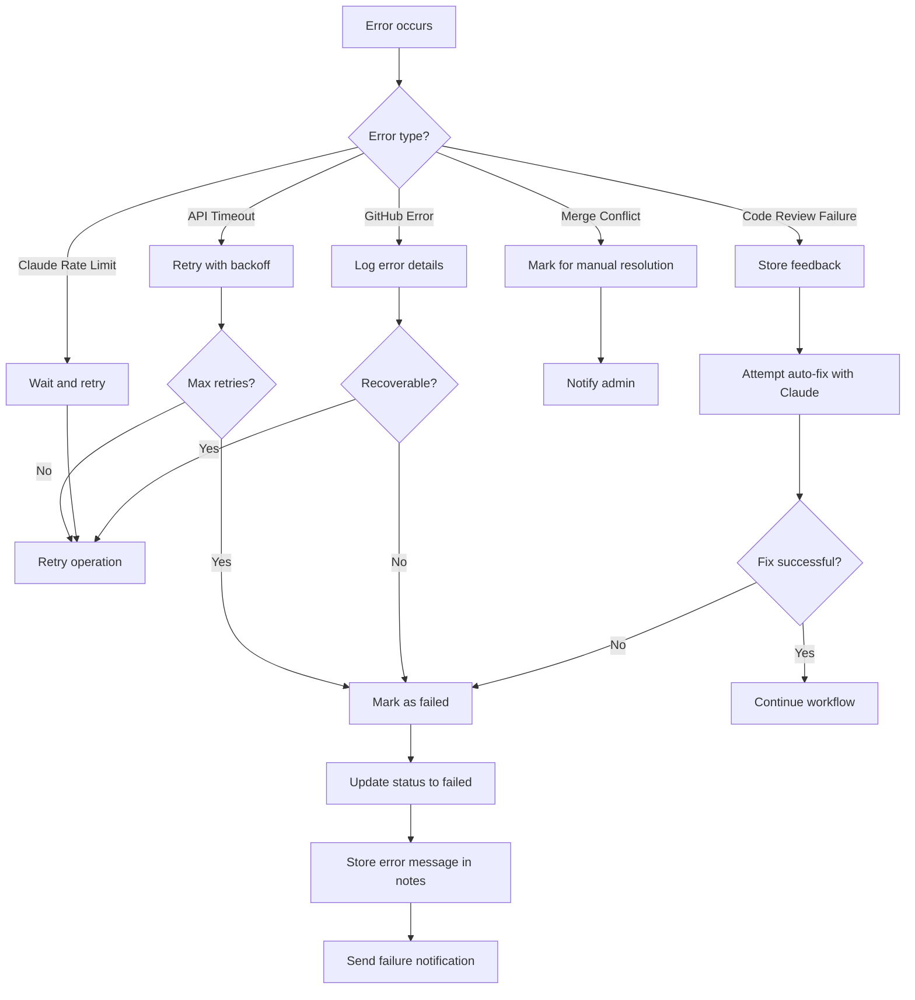
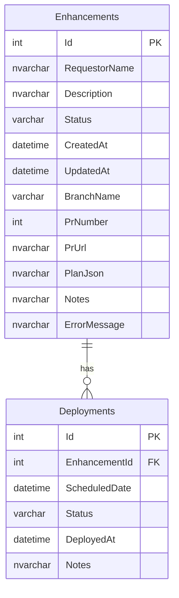

# AI Enhancement Workflow Diagram

This document provides a visual representation of the AI-driven feature enhancement workflow in Modern Accounting.

## High-Level Workflow

```mermaid
flowchart TD
    subgraph User["User Interaction"]
        A[User submits enhancement request] --> B[Chat UI captures description]
    end

    subgraph API["Chat API Processing"]
        B --> C[POST /api/enhancements]
        C --> D[Claude parses user intent]
        D --> E[Enhancement stored in DB<br/>Status: pending]
    end

    subgraph Monitor["Monitor Agent"]
        F[Monitor Agent polls DB] --> G{Pending<br/>enhancement?}
        G -->|No| F
        G -->|Yes| H[Claim enhancement<br/>Status: processing]
    end

    subgraph Planning["AI Planning Phase"]
        H --> I[Claude generates<br/>implementation plan]
        I --> J[Plan stored in DB<br/>Status: planning]
    end

    subgraph Implementation["AI Implementation Phase"]
        J --> K[Create feature branch]
        K --> L[Claude generates code<br/>for each task]
        L --> M[Status: implementing]
        M --> N[Internal code review<br/>using Claude]
        N --> O[Status: reviewing]
    end

    subgraph GitHub["GitHub Integration"]
        O --> P[Commit and push changes]
        P --> Q[Create Pull Request]
        Q --> R[Request Copilot review]
        R --> S[Status: copilot_reviewing]
        S --> T{Copilot<br/>response?}
        T -->|Yes| U[Process review feedback]
        T -->|Timeout| V[Fallback to Claude review]
        U --> W[Status: pr_created]
        V --> W
    end

    subgraph Deployment["Deployment Phase"]
        W --> X[Admin schedules deployment]
        X --> Y[Deployment record created<br/>Status: pending]
        Y --> Z[Scheduler checks<br/>scheduled date]
        Z --> AA{Ready to<br/>deploy?}
        AA -->|No| Z
        AA -->|Yes| AB{CI checks<br/>passed?}
        AB -->|Yes| AC[Merge PR]
        AB -->|No| AD[Deployment failed]
        AC --> AE[Status: deployed]
        AD --> AF[Status: failed]
    end

    E --> F
    AE --> AG[Notification sent<br/>to requestor]
    AF --> AG

    style A fill:#e1f5fe
    style E fill:#fff3e0
    style W fill:#e8f5e9
    style AE fill:#c8e6c9
    style AF fill:#ffcdd2
```

## Detailed Status Flow

## Component Interaction

## Deployment Scheduling

## Error Handling and Recovery

## Database Entity Relationships

## Related Documentation

- [AI Feature System Overview](./ai-feature-system.md)
- [API Reference](./api-reference.md)
- [Setup Guide](./ai-feature-setup.md)
