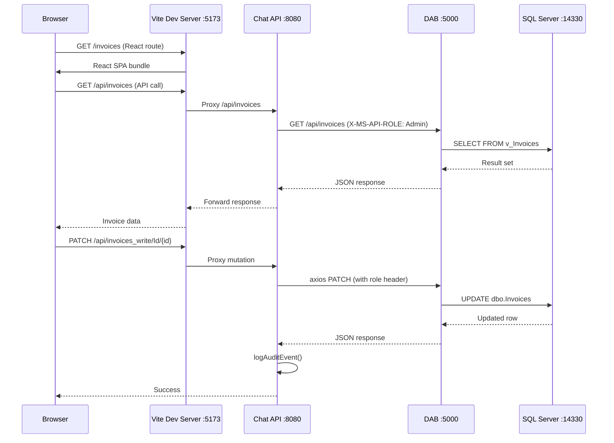
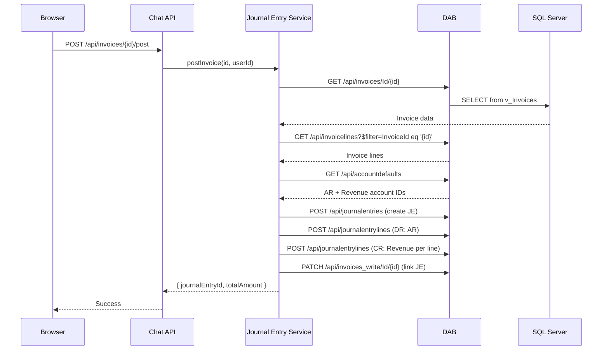
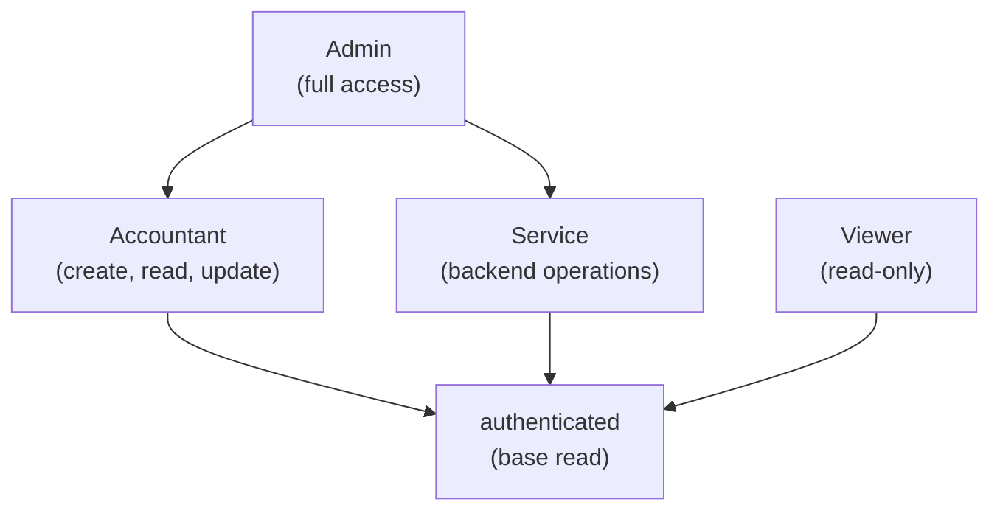

# Modern Accounting - Solution Architecture

## System Overview

Modern Accounting is a full-stack, cloud-native double-entry accounting system built on React, Node.js, SQL Server, and Azure services. It features AI-driven capabilities, multi-tenant support, and integrations with QuickBooks Online, Plaid, and Microsoft Graph.

---

## Architecture Diagram

```mermaid
graph TB
    subgraph Browser["Browser (Client)"]
        UI["React 18 + TypeScript + Vite<br/>MUI 7 + Tailwind CSS<br/>TanStack Query<br/>:5173"]
        MSAL["MSAL Authentication<br/>(Azure AD / Entra ID / B2C)"]
    end

    subgraph ChatAPI["Chat API (Express Node.js) :8080"]
        direction TB
        Proxy["DAB Proxy Middleware<br/>(GET → proxy, mutations → axios)"]
        AuthMW["Auth Middleware<br/>(JWT validation, RBAC, MFA)"]
        AuditLog["Audit Logger"]
        JournalSvc["Journal Entry Service<br/>(GL posting, reversals)"]
        MigrationSvc["Migration Service<br/>(QBO → MA orchestrator)"]
        PlaidSvc["Plaid Service<br/>(bank sync, scheduling)"]
        ContactAI["Contact Extractor<br/>(OCR + Azure OpenAI)"]
        ChatAI["AI Chat Engine<br/>(Azure OpenAI + MCP tools)"]
    end

    subgraph Docker["Docker Services"]
        direction TB
        DAB["Data API Builder 1.7.83<br/>REST + MCP<br/>:5000"]
        SQLDB[("SQL Server 2022<br/>AccountingDB<br/>143 tables<br/>:14330")]
        EmailAPI["Email API<br/>SMTP + Microsoft Graph<br/>PDF generation<br/>:7073"]
        QBOMCP["QBO MCP Server<br/>QuickBooks Online<br/>OAuth + query tools<br/>:8001"]
        MAMCP["MA MCP Server<br/>Schema introspection<br/>Feature discovery<br/>:5002"]
        Monitor["Monitor Agent<br/>AI enhancement processor<br/>(opt-in profile)"]
    end

    subgraph External["External Services"]
        AzureAD["Azure AD /<br/>Entra ID"]
        AzureOAI["Azure OpenAI<br/>(GPT-4)"]
        QBOApi["QuickBooks<br/>Online API"]
        PlaidApi["Plaid API<br/>(Banking)"]
        GraphApi["Microsoft<br/>Graph API"]
        GitHubApi["GitHub API<br/>(PRs, branches)"]
        ClaudeApi["Claude API<br/>(Anthropic)"]
    end

    subgraph Infra["Azure Infrastructure"]
        AppService["App Service"]
        ContainerApps["Container Apps"]
        KeyVault["Key Vault"]
        AppInsights["Application<br/>Insights"]
    end

    %% Client connections
    UI -->|"/api/* (proxy)"| ChatAPI
    UI -->|"/email-api/*"| EmailAPI
    MSAL -->|"OAuth 2.0 / OIDC"| AzureAD

    %% Chat API to DAB
    Proxy -->|"REST API"| DAB
    JournalSvc -->|"REST API<br/>(X-MS-API-ROLE: Admin)"| DAB
    PlaidSvc -->|"REST API<br/>(X-MS-API-ROLE: Service)"| DAB

    %% DAB to SQL
    DAB -->|"TDS"| SQLDB

    %% Direct SQL connections
    EmailAPI -->|"TDS"| SQLDB
    MAMCP -->|"TDS"| SQLDB
    Monitor -->|"TDS"| SQLDB

    %% Chat API to MCP servers
    ChatAI -->|"MCP protocol"| DAB
    ChatAI -->|"MCP protocol"| QBOMCP
    ChatAI -->|"MCP protocol"| MAMCP

    %% External API connections
    ChatAI -->|"HTTPS"| AzureOAI
    ContactAI -->|"HTTPS"| AzureOAI
    MigrationSvc -->|"HTTPS"| QBOApi
    QBOMCP -->|"OAuth 2.0"| QBOApi
    PlaidSvc -->|"HTTPS"| PlaidApi
    EmailAPI -->|"HTTPS"| GraphApi
    Monitor -->|"HTTPS"| ClaudeApi
    Monitor -->|"HTTPS"| GitHubApi

    %% Auth validation
    AuthMW -->|"JWKS validation"| AzureAD

    %% Infrastructure
    AppService -.->|"hosts"| ChatAPI
    ContainerApps -.->|"hosts"| Docker
    KeyVault -.->|"secrets"| AppService
    AppInsights -.->|"telemetry"| AppService

    %% Styling
    classDef browser fill:#4F46E5,color:#fff,stroke:#3730A3
    classDef api fill:#D97706,color:#fff,stroke:#B45309
    classDef docker fill:#0891B2,color:#fff,stroke:#0E7490
    classDef external fill:#059669,color:#fff,stroke:#047857
    classDef infra fill:#7C3AED,color:#fff,stroke:#6D28D9
    classDef db fill:#DC2626,color:#fff,stroke:#B91C1C

    class UI,MSAL browser
    class Proxy,AuthMW,AuditLog,JournalSvc,MigrationSvc,PlaidSvc,ContactAI,ChatAI api
    class DAB,EmailAPI,QBOMCP,MAMCP,Monitor docker
    class AzureAD,AzureOAI,QBOApi,PlaidApi,GraphApi,GitHubApi,ClaudeApi external
    class AppService,ContainerApps,KeyVault,AppInsights infra
    class SQLDB db
```

---

## Service Inventory

### Client Application

| Property | Value |
|----------|-------|
| Framework | React 18 + TypeScript 5 + Vite 4 |
| UI Library | MUI 7 + Tailwind CSS 3 |
| State Management | TanStack React Query 5 |
| Routing | React Router DOM 7 |
| Auth | MSAL Browser 3 (Azure AD / Entra ID / B2C) |
| Dev Port | 5173 |
| Pages | 40+ (Dashboard, Invoices, Bills, Payroll, Reports, Banking, Admin) |
| Dark Mode | Tailwind `.dark` class synced with MUI ThemeProvider |

### Chat API (Express Backend)

| Property | Value |
|----------|-------|
| Runtime | Node.js 18+ / Express 4.18 (ESM) |
| Port | 8080 (proxied from 7071) |
| Auth | JWT validation (Azure AD), RBAC, optional MFA |
| DAB Integration | Proxy for GETs, direct axios for mutations |
| AI | Azure OpenAI (GPT-4) with MCP tool orchestration |
| Key Services | Journal entries, QBO migration, Plaid sync, contact extraction |
| Endpoints | 60+ REST API routes |

### Data API Builder (DAB)

| Property | Value |
|----------|-------|
| Version | 1.7.83-rc |
| Port | 5000 |
| Protocols | REST API + MCP |
| Auth (Dev) | Simulator (X-MS-API-ROLE header) |
| Auth (Prod) | Azure AD / Entra ID |
| Roles | authenticated (read), Admin (*), Accountant (CRU), Service, Viewer |
| Pagination | Default 1000, max 10,000 |
| Cache | 5-second TTL |

### SQL Server

| Property | Value |
|----------|-------|
| Version | SQL Server 2022 |
| Database | AccountingDB |
| Port | 14330 (dev), 14331 (staging) |
| Tables | 143 (86 base + history + views) |
| Volume | `modern-accounting_sql-data` (Docker named volume) |
| Deployment | SqlPackage (.dacpac) or Node.js fallback |

### Email API

| Property | Value |
|----------|-------|
| Port | 7073 |
| Transports | SMTP (Nodemailer) + Microsoft Graph API |
| Features | Templates, reminders, invoice PDFs, delivery tracking |
| Database | Direct SQL Server connection |

### QBO MCP Server

| Property | Value |
|----------|-------|
| Port | 8001 |
| Protocol | HTTP-based MCP (Model Context Protocol) |
| Auth | OAuth 2.0 (intuit-oauth) |
| Environments | Sandbox + Production |
| Tools | qbo_query, qbo_get_status, qbo_analyze_migration |

### MA MCP Server

| Property | Value |
|----------|-------|
| Port | 5002 |
| Protocol | HTTP-based MCP |
| Features | Schema introspection, feature discovery, onboarding |
| Database | Direct SQL Server connection |

### Monitor Agent

| Property | Value |
|----------|-------|
| Port | None (background worker) |
| Activation | `docker compose --profile agent up` |
| AI | Claude API (Anthropic SDK) |
| GitHub | Octokit (branch creation, PR management) |
| Polling | Every 5 minutes (configurable) |
| Flow | Poll enhancements -> Claude plans -> generate code -> create PR |

---

## Data Flow

### Request Lifecycle

### Invoice GL Posting Flow

---

## Port Reference

| Port | Service | Protocol | Environment |
|------|---------|----------|-------------|
| 5173 | React Client (Vite) | HTTP | Dev |
| 3001 | React Client (built) | HTTP | Staging |
| 8080 | Chat API | HTTP | Dev (proxied from 7071) |
| 5000 | DAB | HTTP | Dev |
| 5001 | DAB | HTTP | Staging |
| 5002 | MA MCP Server | HTTP | Dev |
| 5003 | MA MCP Server | HTTP | Staging |
| 7073 | Email API | HTTP | Dev |
| 7074 | Email API | HTTP | Staging |
| 8001 | QBO MCP Server | HTTP | Dev |
| 14330 | SQL Server | TDS | Dev |
| 14331 | SQL Server | TDS | Staging |

---

## Authentication & Authorization

### Role Hierarchy

### Auth Providers

| Provider | Use Case |
|----------|----------|
| Azure AD / Entra ID | Primary production auth (JWT + JWKS) |
| Azure AD B2C | External user self-service sign-up |
| DAB Simulator | Local development (X-MS-API-ROLE header) |
| BYPASS_AUTH=true | E2E testing and local dev |

---

## External Integrations

| Integration | Purpose | Protocol | Library |
|-------------|---------|----------|---------|
| Azure OpenAI | AI chat, document analysis, categorization | HTTPS | @azure/openai |
| QuickBooks Online | Accounting data migration and sync | OAuth 2.0 + REST | intuit-oauth, node-quickbooks |
| Plaid | Bank account linking and transaction sync | HTTPS | plaid SDK |
| Microsoft Graph | Email sending via Exchange Online | HTTPS | @microsoft/microsoft-graph-client |
| GitHub | Automated PR creation for enhancements | HTTPS | @octokit/rest |
| Claude (Anthropic) | AI planning and code generation | HTTPS | @anthropic-ai/sdk |

---

## Infrastructure (Azure)

Deployed via Bicep IaC templates (`infra/azure/`):

| Resource | Purpose |
|----------|---------|
| App Service | Hosts Chat API |
| Container Apps | Hosts DAB, MCP servers, Email API |
| Azure SQL Database | Production database |
| Key Vault | Secrets management |
| Application Insights | Monitoring and telemetry |
| Storage Account | File uploads |

---

## CI/CD Pipelines

| Workflow | Trigger | Actions |
|----------|---------|---------|
| `pr-check.yml` | Pull request | DAB validation, client build, API tests, Playwright E2E |
| `deploy-database.yml` | Manual/merge | SqlPackage deployment, migrations |
| `deploy-dab-config.yml` | Manual/merge | DAB config update and validation |
| `deploy-production.yml` | Manual/merge | Full build, deploy, health check |
| `deploy-qbo-mcp.yml` | Manual/merge | QBO MCP service deployment |
| `deploy-infrastructure.yml` | Manual | Bicep infrastructure provisioning |

---

## Key Architectural Patterns

1. **Proxy + Direct Hybrid** - GETs proxy through to DAB; mutations use direct axios to avoid Kestrel body stream timeouts
2. **Double-Entry Accounting** - Journal Entry Service enforces balanced debits/credits
3. **Multi-Tenant Isolation** - Tenant ID on data rows, middleware enforcement
4. **MCP Protocol** - Standardized AI tool interface for DAB, QBO, and MA servers
5. **AI-Driven Enhancement** - Monitor Agent autonomously processes feature requests via Claude
6. **RBAC at Data Layer** - DAB enforces role-based permissions on every query
7. **Audit Trail** - All data modifications logged with user, timestamp, before/after values
8. **Feature Flags** - Runtime toggles for features at company or global scope
