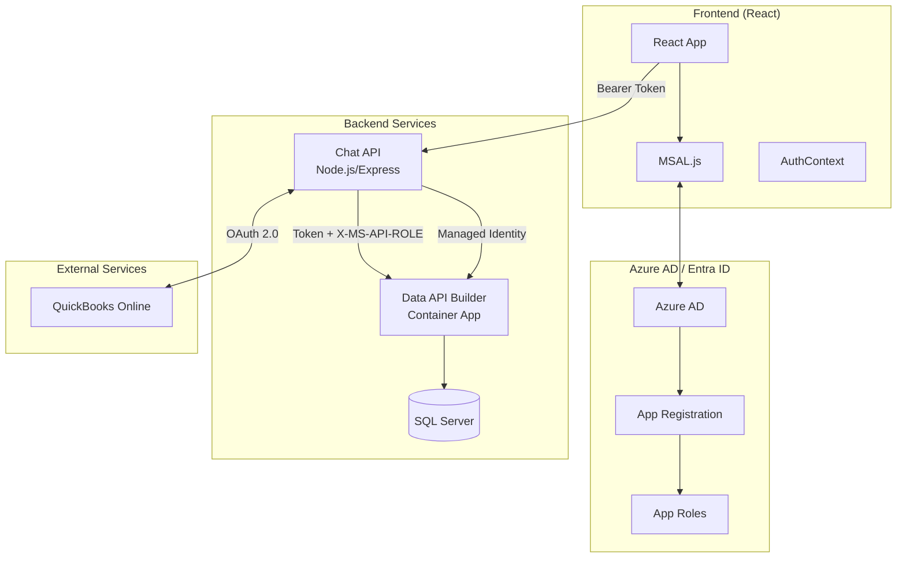
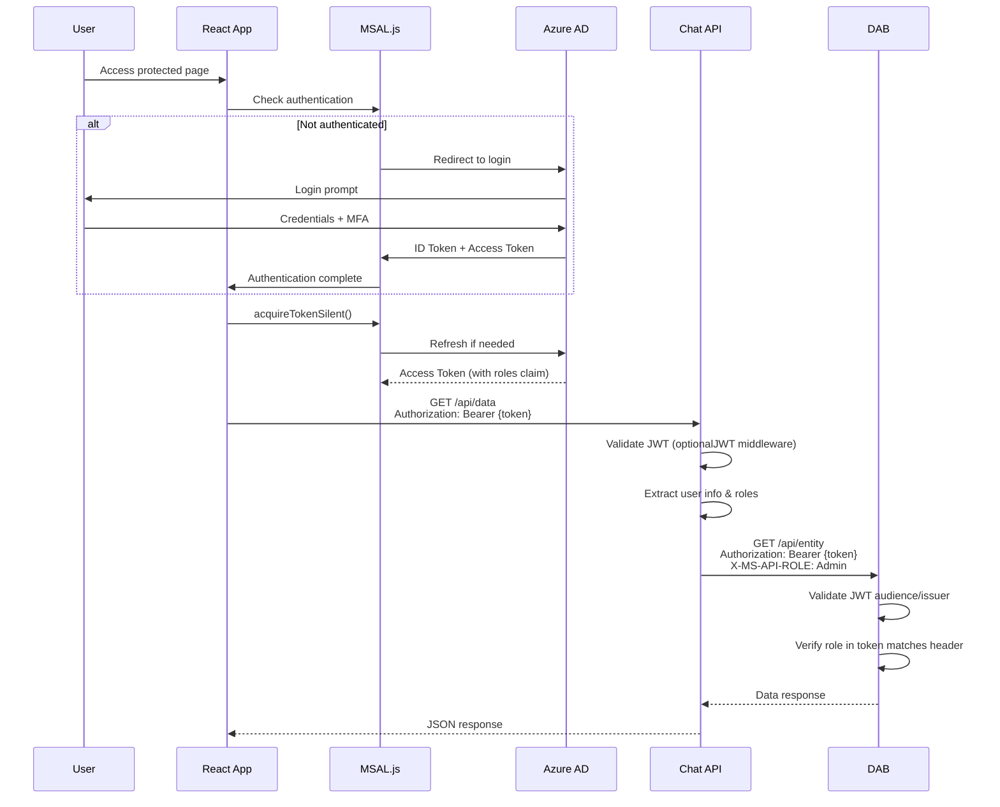
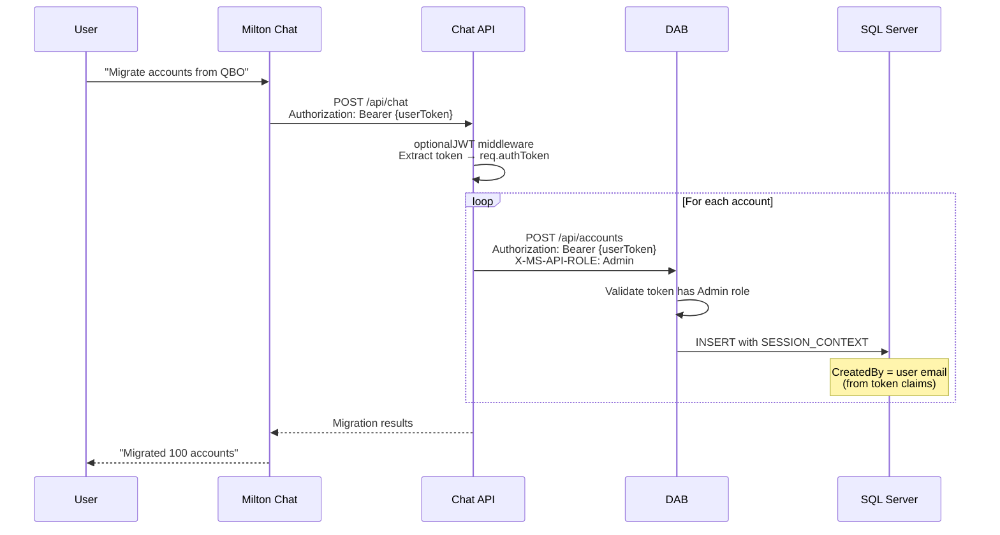
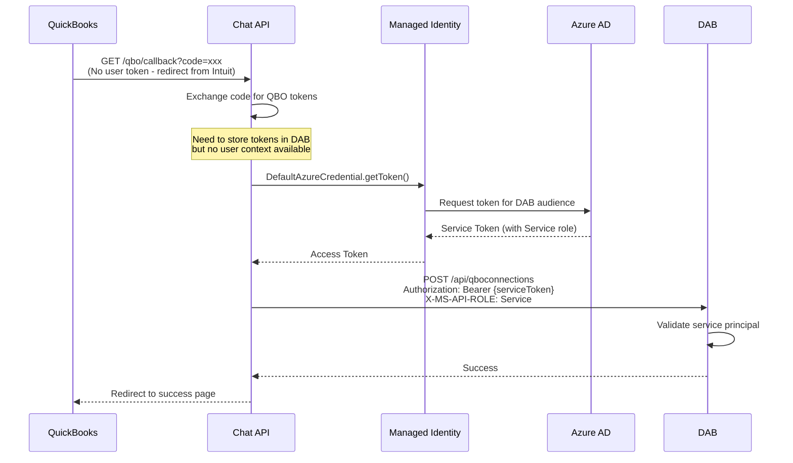
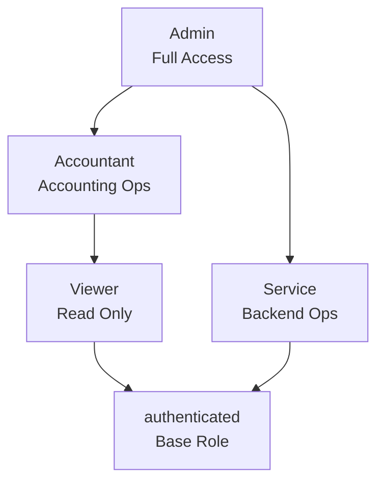
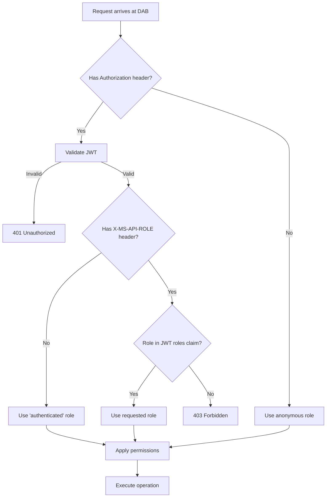
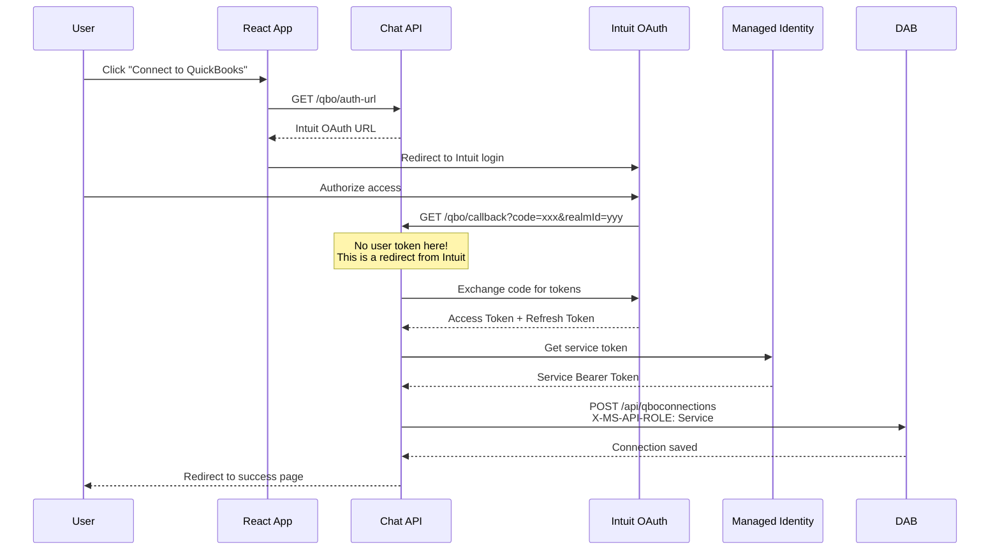

# Authentication & Authorization Architecture

This document describes the end-to-end authentication and authorization flow for Modern Accounting, including token forwarding, DAB role-based access, and backend service authentication.

## Architecture Overview



## Token Flow Scenarios

### 1. User Authentication (Frontend → Backend)

Standard user authentication flow using MSAL and Azure AD.



### 2. Migration with User Context

When users trigger data migrations (e.g., from QuickBooks), their token is forwarded to maintain audit trail.



### 3. Backend Service Authentication (Managed Identity)

For operations without user context (e.g., QBO OAuth callback), use Azure Managed Identity.



## Role Definitions

### Azure AD App Roles

Defined in the App Registration manifest:

| Role | Member Type | Value | Description |
|------|-------------|-------|-------------|
| **Admin** | User | `Admin` | Full system access |
| **Accountant** | User | `Accountant` | Accounting operations |
| **Viewer** | User | `Viewer` | Read-only access |
| **Service** | Application | `Service` | Backend-to-backend calls |

### DAB Permission Mapping

DAB uses these roles to control entity access:

```json
{
    "accounts": {
        "permissions": [
            { "role": "authenticated", "actions": ["read"] },
            { "role": "Accountant", "actions": ["create", "read", "update"] },
            { "role": "Admin", "actions": ["*"] },
            { "role": "Service", "actions": ["*"] }
        ]
    }
}
```

### Role Hierarchy



## X-MS-API-ROLE Header

**Critical:** DAB requires the `X-MS-API-ROLE` header to use role-based permissions.

### Why It's Required

1. DAB validates the JWT and confirms the user is authenticated
2. Without `X-MS-API-ROLE`, DAB defaults to the `authenticated` role
3. The `authenticated` role typically only has read access
4. To use higher roles (Admin, Accountant), you must explicitly request them

### Implementation

```javascript
// chat-api/server.js
class DabRestClient {
    _buildHeaders(authToken = null, role = null) {
        const headers = { 'Content-Type': 'application/json' };
        if (authToken) {
            headers['Authorization'] = `Bearer ${authToken}`;
            // DAB requires this header to use non-default roles
            headers['X-MS-API-ROLE'] = role || 'Admin';
        }
        return headers;
    }
}
```

### Validation Flow



## Token Forwarding

### Middleware Setup

```javascript
// chat-api/src/middleware/auth.js
export async function optionalJWT(req, res, next) {
    const token = extractBearerToken(req.headers.authorization);
    if (!token) {
        req.user = null;
        req.authToken = null;
        return next();
    }

    try {
        const { payload } = await validateToken(token);
        req.user = extractUserInfo(payload);
        req.authToken = token;  // Store for forwarding
    } catch (error) {
        req.user = null;
        req.authToken = null;
    }
    next();
}
```

### Using Forwarded Token

```javascript
// In route handlers
app.post('/api/migrate', optionalJWT, async (req, res) => {
    const authToken = req.authToken;  // User's original token

    // Forward token to DAB for user context
    await dab.createRecord('accounts', data, authToken);
});
```

## Managed Identity Setup

### Azure Configuration

1. **Enable Managed Identity on App Service:**
   ```bash
   az webapp identity assign \
     --name app-modern-accounting-prod \
     --resource-group rg-modern-accounting-prod
   ```

2. **Create Service App Role in Azure AD:**
   ```json
   {
       "allowedMemberTypes": ["Application"],
       "displayName": "Service",
       "value": "Service",
       "description": "Backend-to-backend API calls"
   }
   ```

3. **Assign Role to Managed Identity:**
   ```bash
   # Get App Service managed identity object ID
   PRINCIPAL_ID=$(az webapp identity show \
     --name app-modern-accounting-prod \
     --resource-group rg-modern-accounting-prod \
     --query principalId -o tsv)

   # Get Service Principal ID for the app
   SP_ID=$(az ad sp show --id $APP_CLIENT_ID --query id -o tsv)

   # Assign the Service role
   az rest --method POST \
     --url "https://graph.microsoft.com/v1.0/servicePrincipals/$SP_ID/appRoleAssignments" \
     --body "{
       \"principalId\": \"$PRINCIPAL_ID\",
       \"resourceId\": \"$SP_ID\",
       \"appRoleId\": \"$SERVICE_ROLE_ID\"
     }"
   ```

### Code Implementation

```javascript
// chat-api/qbo-auth.js
import { DefaultAzureCredential } from '@azure/identity';

const DAB_AUDIENCE = process.env.AZURE_AD_AUDIENCE;
let azureCredential = null;
let cachedToken = null;
let tokenExpiry = null;

async function getDabAuthToken() {
    // Skip for local development
    if (DAB_API_URL.includes('localhost')) return null;

    // Return cached token if still valid
    if (cachedToken && tokenExpiry &&
        new Date() < new Date(tokenExpiry.getTime() - 5 * 60 * 1000)) {
        return cachedToken;
    }

    try {
        if (!azureCredential) {
            azureCredential = new DefaultAzureCredential();
        }

        const scope = `api://${DAB_AUDIENCE}/.default`;
        const tokenResponse = await azureCredential.getToken(scope);

        cachedToken = tokenResponse.token;
        tokenExpiry = new Date(tokenResponse.expiresOnTimestamp);

        return cachedToken;
    } catch (error) {
        console.error('Failed to acquire DAB auth token:', error.message);
        return null;
    }
}
```

## QuickBooks OAuth Flow



## Troubleshooting

### 403 Forbidden on Write Operations

**Symptoms:**
- Reads work, writes fail with 403
- Token appears valid

**Checklist:**
1. Is `X-MS-API-ROLE` header being sent?
2. Does user have the role in Azure AD?
3. Is the role in the JWT `roles` claim?
4. Does DAB config have permissions for that role?

**Debug:**
```bash
# Decode JWT to check roles
# Paste token at https://jwt.ms

# Check user's role assignments
az rest --method GET \
  --url "https://graph.microsoft.com/v1.0/servicePrincipals/{sp-id}/appRoleAssignedTo"
```

### Token Not Being Forwarded

**Symptoms:**
- `req.authToken` is null in route handlers
- DAB calls fail with 401

**Checklist:**
1. Is `optionalJWT` middleware applied to the route?
2. Is frontend sending Authorization header?
3. Is token format correct (`Bearer {token}`)?

### Managed Identity Fails

**Symptoms:**
- QBO callback fails to save connection
- Error: "Failed to acquire DAB auth token"

**Checklist:**
1. Is managed identity enabled on App Service?
2. Is Service app role assigned to the identity?
3. Is `AZURE_AD_AUDIENCE` env var set correctly?
4. Is DAB config updated with Service role permissions?

## Environment Variables

### Chat API (Production)

```bash
# Azure AD
AZURE_AD_TENANT_ID=your-tenant-id
AZURE_AD_CLIENT_ID=your-client-id
AZURE_AD_AUDIENCE=2685fbc4-b4fd-4ea7-8773-77ec0826e7af
AZURE_AD_ISSUER=https://login.microsoftonline.com/{tenant-id}/v2.0

# DAB
DAB_REST_URL=https://dab-ca-modern-accounting.azurecontainerapps.io/api
```

### DAB Container App

```bash
# Authentication
AZURE_AD_AUDIENCE=2685fbc4-b4fd-4ea7-8773-77ec0826e7af
AZURE_AD_ISSUER=https://login.microsoftonline.com/{tenant-id}/v2.0

# Database
DATABASE_CONNECTION_STRING=@Microsoft.KeyVault(SecretUri=...)
```

### Frontend

```bash
VITE_AZURE_CLIENT_ID=2685fbc4-b4fd-4ea7-8773-77ec0826e7af
VITE_AZURE_TENANT_ID=your-tenant-id
VITE_AZURE_AUTHORITY=https://login.microsoftonline.com/{tenant-id}
```

## Security Principles

1. **Never expose anonymous write access** - All mutations require authentication
2. **Forward user tokens for audit trail** - Migrations use user context, not service identity
3. **Use managed identity for backend ops** - OAuth callbacks use service identity
4. **Always specify role header** - DAB requires explicit role selection
5. **Validate at every layer** - Frontend, API, and DAB all validate tokens
